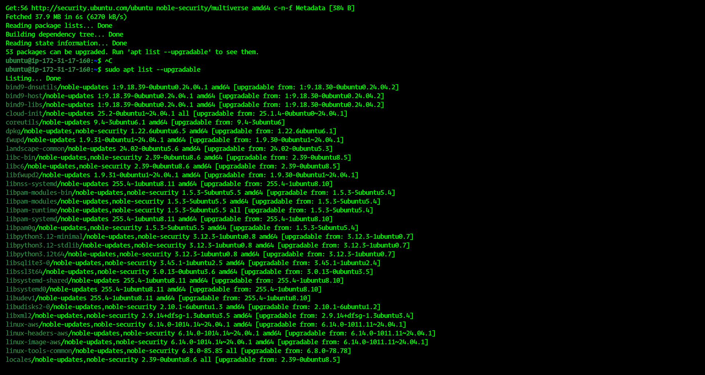
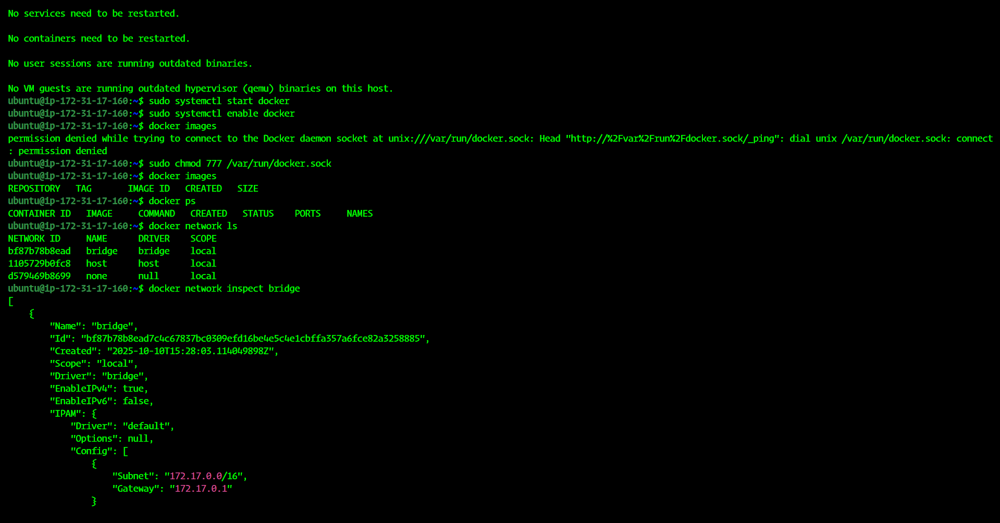
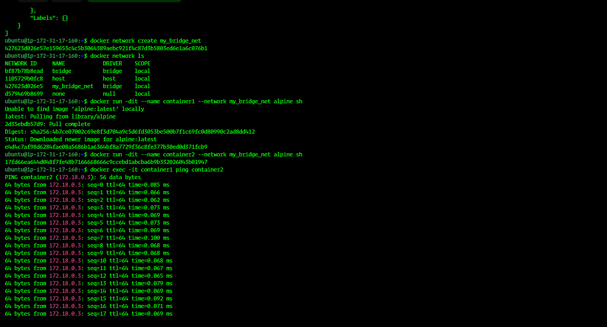
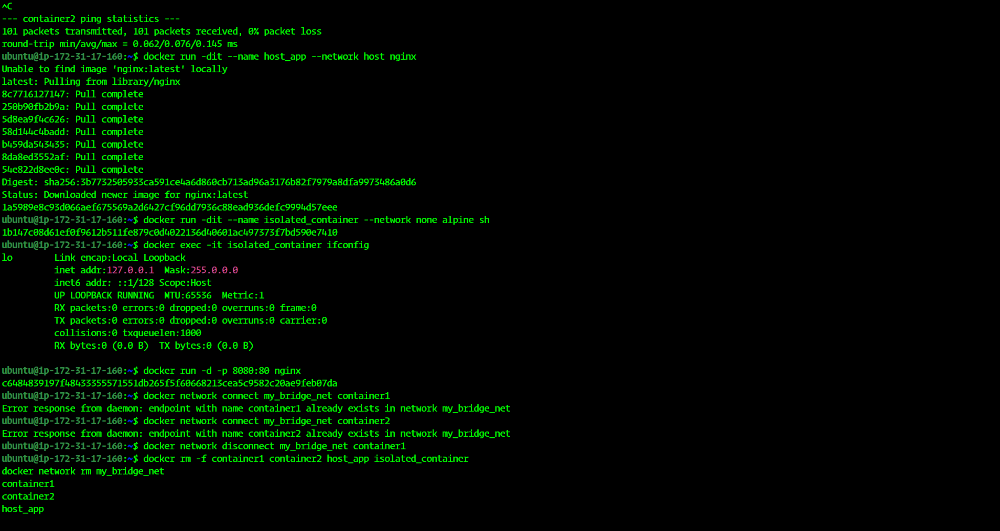
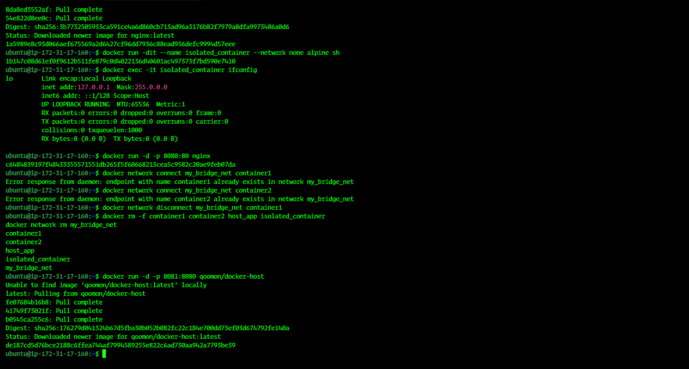

# 🐳 Docker Networking Practice Guide

## 🔍 Overview
Docker networking lets containers **communicate** — with each other, with the host, and with the outside world.  
Think of it as the **digital plumbing** that keeps your containerized apps talking smoothly.  

---

## 🧠 Key Networking Concepts

| Network Type | Description | Typical Use Case |
|---------------|--------------|------------------|
| **bridge** | Default network; containers get a private IP and communicate through Docker’s virtual bridge. | Local container communication |
| **host** | Container shares the host machine’s network stack. | High-performance apps (no network isolation) |
| **none** | Container has no network connection. | Security isolation or offline processing |
| **overlay** | Enables communication across multiple Docker hosts (used in Swarm). | Multi-host or clustered environments |
| **macvlan** | Assigns a MAC address to each container, making it appear as a physical device on the network. | When containers need to look like physical machines |

---

## 🧪 Step-by-Step Practice Tasks

### 🧩 1. Check Existing Networks
```bash
docker network ls
````

This lists all networks managed by Docker.

---

### 🏗️ 2. Inspect the Default Bridge Network

```bash
docker network inspect bridge
```

You’ll see containers attached, subnets, and IP details.

---

### 🧱 3. Create Your Own Bridge Network

```bash
docker network create my_bridge_net
docker network ls
```

✅ **Why:** Helps isolate containers in a custom virtual network.

---

### 💬 4. Connect Containers within the Same Network

```bash
docker run -dit --name container1 --network my_bridge_net alpine sh
docker run -dit --name container2 --network my_bridge_net alpine sh
docker exec -it container1 ping container2
```

You’ll notice containers can **ping each other by name** — Docker handles internal DNS automatically.

---

### 🌐 5. Use Host Network Mode

```bash
docker run -dit --name host_app --network host nginx
```

✅ **Why:** Gives your container direct access to host ports — no port mapping required.
⚠️ **Be careful** — less isolation, but faster networking.

---

### 🚫 6. Try None Network Mode

```bash
docker run -dit --name isolated_container --network none alpine sh
```

Check:

```bash
docker exec -it isolated_container ifconfig
```

No network interfaces other than `lo` (loopback) — total isolation 🔒

---

### 🌍 7. Port Mapping Demo

```bash
docker run -d -p 8080:80 nginx
```

Visit:
👉 **http://<your-public-ip>:8080**

✅ **Why:** Maps host port 8080 → container’s port 80.

---

### 🧠 8. Connect Existing Containers to a Network

```bash
docker network connect my_bridge_net container1
docker network connect my_bridge_net container2
```

This allows containers from different networks to communicate.

---

### 🧩 9. Disconnect Containers from a Network

```bash
docker network disconnect my_bridge_net container1
```

---

### 🚀 10. Cleanup

```bash
docker rm -f container1 container2 host_app isolated_container
docker network rm my_bridge_net
```

---

## 🧭 Bonus: Visualizing Docker Networks

Use this tool for visualization:

```bash
docker run -d -p 8081:8080 qoomon/docker-host
```

Visit **[http://localhost:8081](http://localhost:8081)** for a visual layout of your Docker networks.

---

## 🧾 Summary

| Concept                 | Command                             | Purpose                                  |
| ----------------------- | ----------------------------------- | ---------------------------------------- |
| List networks           | `docker network ls`                 | View all Docker networks                 |
| Create network          | `docker network create <name>`      | Make a new bridge network                |
| Run with custom network | `docker run --network <name>`       | Launch containers on specific network    |
| Inspect network         | `docker network inspect <name>`     | See detailed info about a network        |
| Connect/disconnect      | `docker network connect/disconnect` | Dynamically manage container connections |

---

## 💡 Pro Tip

If you’re into **Docker Compose**, you can define networks in your `docker-compose.yml` like this:

```yaml
networks:
  backend:
  frontend:
```

Then assign them to services:

```yaml
services:
  app:
    image: myapp
    networks:
      - backend
```

---

## 🏁 Wrap-Up

Docker networking is one of those things that **looks simple** until you realize how powerful it is.
Once you get comfortable with bridge and host modes, you’ll be ready to handle **multi-container, multi-host** setups like a pro ⚡

---

✍️ **Author:** Sahil (Engineering Student @ SPPU)
📅 **Updated:** October 2025
📘 **Topic:** Docker Networking (Hands-on Practice)


# Steps Which i done
# AWS Running Services Check — Steps with Screenshots

1. Step 1 
   

2. Step 2
   

3. Step 3 
   

4. Step 4 
   

5. Step 5  
   

6. Step 6
   
