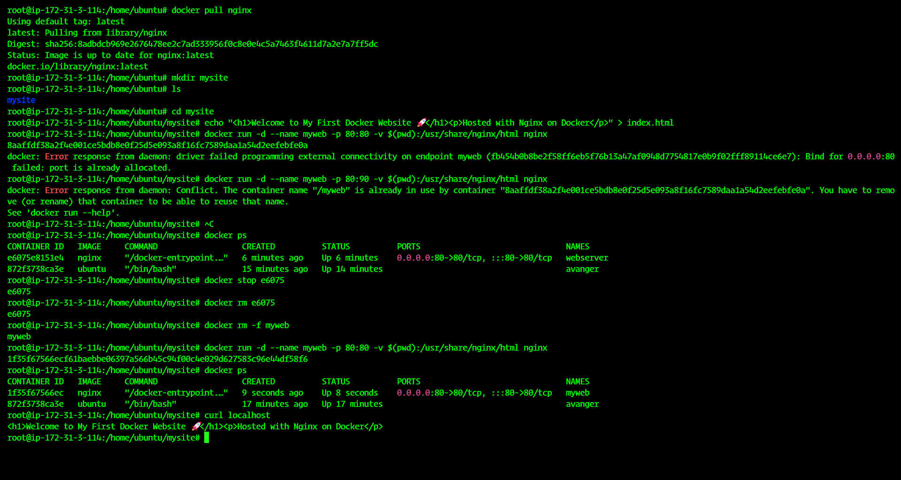
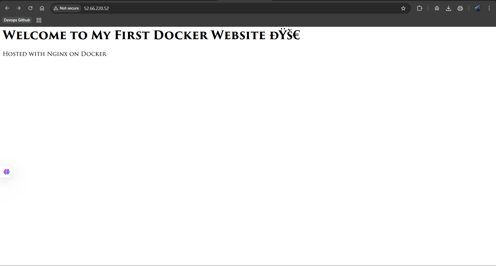

# My First Dockerized Website

This project demonstrates how to host a simple static website using **Docker** and **Nginx** on Ubuntu.

---

## 🛠 Prerequisites

- Ubuntu system
- Docker installed and running
- Basic knowledge of Linux commands

---

## 📂 Project Structure

```

mysite/
└── index.html

````

- `index.html` — Your custom HTML page

---

## 🚀 Steps to Run

### 1. Pull the Nginx image
```bash
docker pull nginx
````

### 2. Create project folder

```bash
mkdir mysite
cd mysite
```

### 3. Create your custom HTML page

```bash
echo "<h1>Welcome to My First Docker Website 🚀</h1><p>Hosted with Nginx on Docker</p>" > index.html
```

### 4. Run the Docker container

```bash
docker run -d --name myweb -p 80:80 -v $(pwd):/usr/share/nginx/html nginx
```

* `-d` → detached mode
* `--name myweb` → name your container
* `-p 80:80` → map host port 80 to container port 80
* `-v $(pwd):/usr/share/nginx/html` → mount local folder to container

**⚠️ Common issues:**

* If you see `port is already allocated`, stop the container using port 80:

```bash
docker ps
docker stop <container_id>
docker rm <container_id>
```

* If you see `container name is already in use`, remove or rename it:

```bash
docker rm -f myweb
```

### 5. Verify the container is running

```bash
docker ps
```

### 6. Test your website

```bash
curl localhost
```

Output should display your custom HTML:

```html
<h1>Welcome to My First Docker Website 🚀</h1><p>Hosted with Nginx on Docker</p>
```

---

## 🔍 Access via Browser

Open your **EC2 public IP** (or localhost if local machine) in a browser:

```
http://<your-ec2-public-ip>
```
---
## Screenshots - With Code + Output

CLI Through


OUTPUT


---

## ✅ Key Learnings

* Docker container lifecycle (`run`, `stop`, `rm`)
* Handling port conflicts and container name conflicts
* Mounting volumes for persistent/static content
* Using Nginx to serve static websites

---

## 💡 Next Steps

* Add more pages to your website
* Customize Nginx configuration
* Explore Docker Compose for multi-container setups
